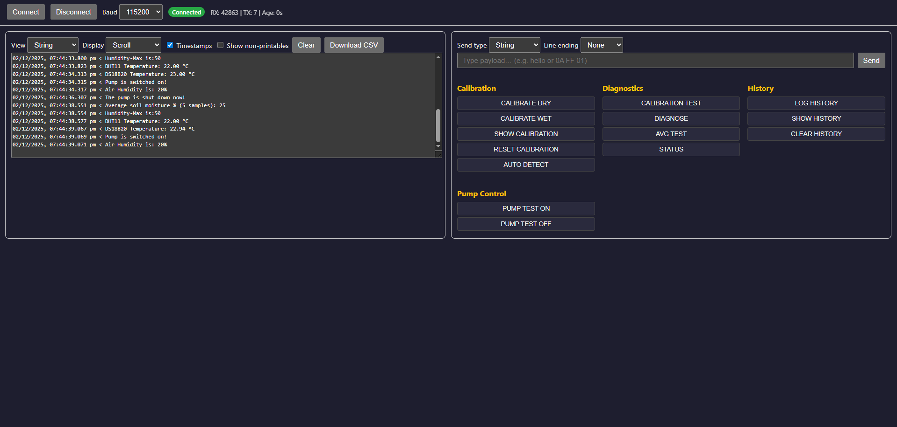

# 🌱 Local Serial Water Monitor

A browser-based **Web Serial dashboard** for monitoring and controlling your Arduino-based watering system.  
This project provides a unified interface to connect, log, calibrate, and control soil moisture sensors and pumps directly from your local machine.

---

## 🚀 Features
- Connect/disconnect via Web Serial (Chromium-based browsers required).
- Real-time RX/TX logging with timestamps, hex/string views, and CSV export.
- Command buttons grouped by **Calibration**, **Diagnostics**, **History**, and **Pump Control**.
- Responsive UI with mobile-friendly layout.
- Visual feedback: status badges, flash effects, and animated tooltips.

---

## 📋 Command Reference

| Command             | Description                                                                 |
|---------------------|-----------------------------------------------------------------------------|
| **CALIBRATE DRY**   | Save current ADC as dry baseline                                            |
| **CALIBRATE WET**   | Save current ADC as wet baseline                                            |
| **SHOW CALIBRATION**| Print dry and wet baseline values                                           |
| **RESET CALIBRATION**| Reset baselines to default (Dry=800, Wet=300)                              |
| **AUTO DETECT**     | Auto-detect sensor type and set calibration defaults                        |
| **CALIBRATION TEST**| Run 20s loop printing raw ADC and moisture %                                |
| **DIAGNOSE**        | Snapshot of sensor type, baselines, raw ADC, and moisture %                 |
| **LOG HISTORY**     | Store 5 averaged moisture readings into EEPROM                              |
| **SHOW HISTORY**    | Print stored moisture history from EEPROM                                   |
| **CLEAR HISTORY**   | Reset EEPROM history to zero                                                |
| **AVG TEST**        | Print rolling average moisture % (5 samples)                                |
| **PUMP TEST ON**    | Manually switch pump ON                                                     |
| **PUMP TEST OFF**   | Manually switch pump OFF                                                    |
| **STATUS**          | Print full system status (soil, air humidity, temps, pump state)            |

---

## 🖥️ Usage
1. Open the dashboard in a Chromium-based browser (e.g., Chrome, Edge).
2. Click **Connect** and select your Arduino/ESP device.
3. Choose baud rate (default: `115200`).
4. Use the command buttons or type payloads manually.
5. Monitor logs in **scroll** or **split RX/TX** mode.
6. Export logs as CSV for analysis.

---

## ⚙️ Requirements
- Arduino/ESP device with soil moisture sensor + pump relay.
- Chromium-based browser with [Web Serial API](https://developer.mozilla.org/en-US/docs/Web/API/Serial).
- Local hosting (e.g., XAMPP/Apache) recommended for unified dashboards.

### 🔧 Recommended Hardware
- **Arduino Leonardo (Ecoduino Project)**  
  The Leonardo is well-suited for this project thanks to its native USB support and compatibility with Ecoduino’s soil monitoring ecosystem. It provides reliable serial communication and integrates smoothly with moisture sensors and pump relays.

---

## 📂 Project Structure
- `index.html` → Main dashboard UI + logic.
- Inline CSS/JS for portability.
- CSV export for serial logs.

---

## 📸 Screenshots & Demo

Here’s what the dashboard looks like in action:

- **Main Dashboard** – Connect/disconnect, live RX/TX logs, and CSV export.  
- **Command Groups** – Calibration, Diagnostics, History, and Pump Control buttons with flash feedback.  
- **Split View Mode** – Separate RX/TX panes for clarity.  

---

## 🛠️ Roadmap
- Add live device status badges for multiple ESP endpoints.
- Expand diagnostic views with trend arrows and last-updated age.
- Theme toggles and mobile gesture support.

---

## 📜 License
MIT License – free to use, modify, and share.

---

## 🔖 Tags
`arduino` `esp32` `esp8266` `ecoduino` `soil-moisture` `pump-control`  
`web-serial` `serial-monitor` `dashboard` `iot` `home-automation`  
`water-monitor` `sensor-calibration` `csv-logging` `ui-ux` `responsive-design`
